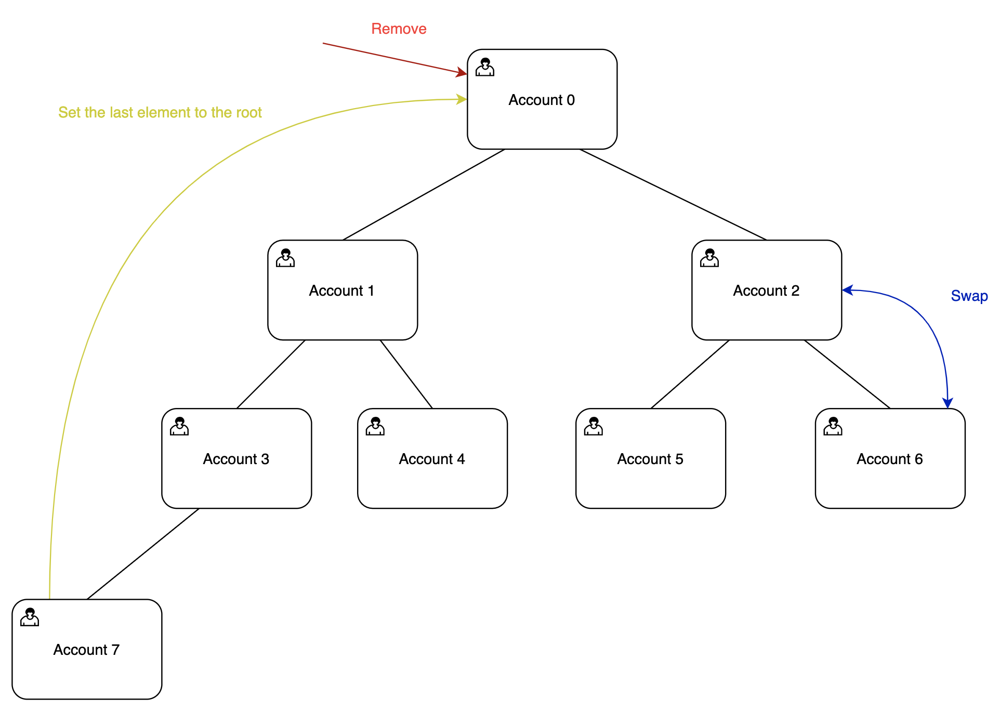

[Heap](https://www.cs.usfca.edu/~galles/visualization/Heap.html) on Solana.

# Heap

Such as Solana stores all the data in accounts we can use different data structures on blockchain itself. Here is implementation of heap on blockchain.

A heap is a useful data structure when it is necessary to repeatedly remove the object with the highest (or lowest) priority.
Here we need to assign index to every node(which is account). We can do it by creating program accounts generated from the seed with index.
In such case we achieve security such as heap elements don't have any private keys and we can easily generate offline all the element's keys by knowing size of the heap.
Every node can store data up to 32 bytes.

Here is operations available in current program:
- Init heap
- Add node
- Remove root node
- Swap node's data



### Build and test for program compiled natively
```
$ cargo build
$ cargo test
```

### Build and test the program compiled for BPF
```
$ cargo build-bpf
$ cargo test-bpf
```